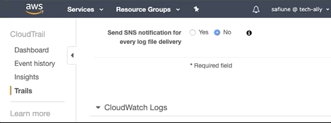

# Lacework Terraform Provisioning for AWS
Terraform modules that create AWS resources required to integrate AWS accounts with the Lacework Cloud Security Platform.

## AWS Config and CloudTrail Integration Overview
In order for Lacework to monitor AWS configuration and CloudTrail activity, the following must be configured your AWS account: 

#### Required Resources
- **Cross Account IAM Role** - Delegate access to Lacework to monitor resource configurations within customer's AWS account. This role is used for both the Config and CloudTrail
  - `SecurityAudit` Policy - AWS managed policy to allow Lacework to assess configuration. Policy is applied for configuration assessment only.
  - Custom IAM Policy - Delegate access to Lacework to monitor CloudTrail Activity. Policy is attached to the IAM role when for CloudTrail is configured.
- **CloudTrail** - Enable a new CloudTrail or use an existing
  - **S3 Bucket** - Used to store CloudTrail logs. Create a new S3 bucket, or use an existing
  - **SNS Topic** - Used to send notifications when CloudTrail publishes new log files to the configured S3 bucket. Use existing or create a new SNS topic.
  - **SQS Queue** - SQS queue subscribed to CloudTrail SNS topic for Lacework  
- **Lacework AWS CFG Integration** - Configures AWS CFG integration between Lacework and customer AWS account
- **Lacework AWS CT Integration** - Configures AWS CT integration between Lacework and customer AWS account

## Requirements
Before you begin the following must be configured on the workstation running Terraform

- [Terraform](terraform.io/downloads.html) `v0.12.x`
- [AWS API Access Key, Secret Access Key](https://aws.amazon.com/premiumsupport/knowledge-center/create-access-key/)
- [Lacework API Key](https://support.lacework.com/hc/en-us/articles/360011403853-Generate-API-Access-Keys-and-Tokens)

## Usage

### Enable New CloudTrail Configuration
This example enables a new CloudTrail, IAM Role for Lacework, and then configures both integrations with Lacework

```hcl
provider "aws" {}

provider "lacework" {}

module "aws_config" {
  source = "github.com/lacework/terraform-provisioning/aws/modules/config"
}

module "aws_cloudtrail" {
  source                = "github.com/lacework/terraform-provisioning/aws/modules/cloudtrail"
  bucket_force_destroy  = true
  use_existing_iam_role = true
  iam_role_name         = module.aws_config.iam_role_name
  iam_role_external_id  = module.aws_config.external_id
}
```

### Integrate Existing CloudTrail Without SNS Delivey with Lacework
This example uses an existing CloudTrail and S3 bucket passed as inputs to the module. The example creates the SNS topic, SQS queue, and IAM Role for Lacework, and then configures both integrations with Lacework.
```hcl
provider "aws" {}

provider "lacework" {}

module "aws_config" {
  source = "github.com/lacework/terraform-provisioning/aws/modules/config"
}

module "aws_cloudtrail" {
  source = "github.com/lacework/terraform-provisioning/aws/modules/cloudtrail"

  use_existing_cloudtrail = true
  bucket_name             = "lacework-ct-bucket-8805c0bf"

  use_existing_iam_role = true
  iam_role_name         = module.aws_config.iam_role_name
  iam_role_external_id  = module.aws_config.external_id
}
```

**NOTE: This example does not modify your CloudTrail, therefore, you have to enable SNS delivery notifications manually and point to the generated SNS topic.**



### Integrate Existing CloudTrail With SNS Delivey Enabled with Lacework
This example uses an existing CloudTrail, S3 bucket, and SNS topic passed as inputs to the module. The example creates the SQS queue and IAM Role for Lacework, and then configures both integrations with Lacework.
```hcl
provider "aws" {}

provider "lacework" {}

module "aws_config" {
  source = "github.com/lacework/terraform-provisioning/aws/modules/config"
}

module "aws_cloudtrail" {
  source = "github.com/lacework/terraform-provisioning/aws/modules/cloudtrail"

  use_existing_cloudtrail = true
  bucket_name             = "lacework-ct-bucket-8805c0bf"
  sns_topic_name          = "lacework-ct-sns-8805c0bf"

  use_existing_iam_role = true
  iam_role_name         = module.aws_config.iam_role_name
  iam_role_external_id  = module.aws_config.external_id
}
```

**NOTE: This example assumes that your CloudTrail is already sending delivery notifications to the provided SNS topic.**

### Enable New Consolidated CloudTrail Configuration
This example enables a new Consolidated CloudTrail and IAM Role for Lacework, then configures both integrations with Lacework,
finally, it configures a new CloudTrail in an AWS sub-account that points to the main CloudTrail.

```hcl
provider "lacework" {
  alias = "main"
}

provider "aws" {
  alias = "main"
}

module "main_cloudtrail" {
  source    = "github.com/lacework/terraform-provisioning/aws/modules/cloudtrail"
  providers = {
    aws      = aws.main
    lacework = lacework.main
  }
  consolidated_trail = true
}

provider "aws" {
  alias = "sub_account"
}

resource "aws_cloudtrail" "lw_sub_account_cloudtrail" {
  provider              = aws.sub_account
  name                  = "lacework-sub-trail"
  is_multi_region_trail = true
  s3_bucket_name        = module.main_cloudtrail.bucket_name
  sns_topic_name        = module.main_cloudtrail.sns_arn
}
```

## Inputs

| Name | Description | Type | Default | Required |
|------|-------------|------|---------|:--------:|
| bucket_force_destroy | Force destroy bucket (Required when bucket not empty) | `bool` | false | no |
| bucket_name | Name of S3 bucket | `string` | lacework- | no |
| bucket_enable_encryption | Set this to `true` to enable encryption on a created S3 bucket | `bool` | false | no |
| bucket_enable_logs | Set this to `true` to enable access logging on a created S3 bucket | `bool` | false | no |
| bucket_enable_versioning | Set this to `true` to enable access logging on a created S3 bucket | `bool` | false | no |
| bucket_sse_algorithm | Name of the server-side encryption algorithm to use ("AES256" or "aws:kms") | `string` | AES256 | no |
| bucket_sse_key_arn | The ARN of the KMS encryption key to be used (Required when using "aws:kms") | `string` | "" | no |
| cloudtrail_name | Name of existing cloudtrail | `string` | "lacework-cloudtrail" | no |
| external_id_length | Length of External ID (max 1224) | `number` | 16 | no |
| iam_role_external_id | External ID for IAM Role | `string` | "" | no |
| iam_role_name |  The IAM role name | `string` | "lacework_iam_role" | no |
| lacework_account_id | The Lacework AWS account that the IAM role will grant access | `string` | 434813966438 | no |
| lacework_integration_name | The name of the integration in Lacework. This input is available in both the config, and the cloudtrail module | `string` | TF config | no |
| log_bucket_name | Name of the S3 bucket for access logs | `string` | "" | no |
| prefix | The prefix that will be use at the beginning of every generated resource | `string` | lacework-ct | no |
| sns_topic_name | SNS topic name. Can be used when generating a new resource or when using an existing resource. | `string` | "" | no |
| sqs_queue_name | SQS queue name. Can be used when generating a new resource or when using an existing resource. | `string` | "" | no |
| sqs_queues | List of SQS queues to configure in the Lacework cross-account policy. | `list(string)` | `[]` | no |
| consolidated_trail | Set this to `true` to configure a consolidated cloudtrail. | `bool` | `false` | no |
| use_existing_cloudtrail | Set this to `true` to use an existing cloudtrail. When set to `true` you must provide both the `bucket_name` and `sns_topic_name` | `bool` | `false` | no |
| use_existing_iam_role | Set this to `true` to use an existing IAM role. When set to `true` you must provide both the `iam_role_name` and `iam_role_external_id` | `bool` | `false` | no |

## Outputs

| Name | Description |
|------|-------------|
| external_id | Dynamically generated External ID configured into the IAM role |
| iam_role_name | IAM Role name generated |
| iam_role_arn | IAM Role ARN |
| bucket_name | S3 Bucket name |
| sqs_name | SQS Queue name |
| sqs_arn | SQS Queue ARN |
| sns_arn | SNS Topic ARN |
